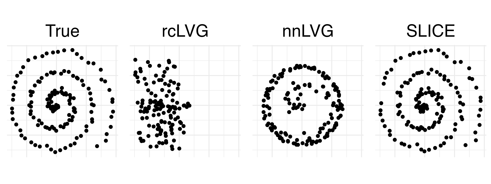

# Sparse + Low Rank Inverse Covariance Estimation (SLICE) Experiments
SLICE proposes an effective algorithm for the sparse + low rank Gaussian graphical model. The objective we seek to minimize is:

```math
\underbrace{- \mathcal{L}(\boldsymbol{\hat{S}};(\boldsymbol{\tilde{\Sigma}}^{-1} - \boldsymbol{\hat{L}})^{-1}) + \rho \|\boldsymbol{\hat{S}}\|_1}_{\text{penalized negative log likelihood}} 
+ \underbrace{\|\boldsymbol{\tilde{\Sigma}}(\boldsymbol{\hat{S}} + \boldsymbol{\hat{L}}) - \boldsymbol{I}\|_F^2}_{\text{covariance fidelity}} 
\ \text{s.t. } \mathcal{R}(\boldsymbol{\hat{L}}) = r, \ \text{where } 0 < r < p
```

We propose an efficient pseudo-EM algorithm which proceeds by alternating between two steps in block coordinate descent fashion. The first step is a closed-form solution for the low rank update

```math
\boldsymbol{\hat{L}} = \text{SVD}_r(\boldsymbol{\tilde{\Sigma}}^{-1} - \boldsymbol{\hat{S}}).
```

The second step is a sparse Gaussian graphical model problem of the sample covariance matrix conditioned on the low rank matrix. This can be solved using standard methods such as [GLASSO; Friedman et al., 2008](https://academic.oup.com/biostatistics/article/9/3/432/224260), [CLIME; Cai et al., 2011](https://www.tandfonline.com/doi/abs/10.1198/jasa.2011.tm10155), among others:

```math
{\boldsymbol{\hat{S}}}^{(i+1)} = {\underset{\boldsymbol{\hat{S}}}{\text{argmax}}} \, Q({\boldsymbol{\hat{S}}} \mid {\boldsymbol{\hat{S}}}^{(i)}).
```

## Simulations
We show improved recovery of both sparse (in F1 score) and low rank (in all measures) components against the state-of-the-art ([tGLASSO; Wang and Allen, 2023](https://academic.oup.com/biomet/article-abstract/110/3/681/6820916?redirectedFrom=fulltext), [rcLVG; Yuan, 2012](https://projecteuclid.org/journals/annals-of-statistics/volume-40/issue-4/Discussion-Latent-variable-graphical-model-selection-via-convex-optimization/10.1214/12-AOS979.full?tab=ArticleLink), [nnLVG; Chandrasekaran et al., 2012](https://www.jstor.org/stable/41806519)). Importantly, we drastically improve upon current methods in estimating the low rank, latent component. An example of this improvement is best shown in the following comparison:

<p align="center">
  
  
</p>

Our comprehensive simulation results are provided below:


### Simulation Setting 1 (Random Clusters)
| Method       | TPR($\hat{\boldsymbol{S}}, \boldsymbol{S}^*$) | TNR($\hat{\boldsymbol{S}}, \boldsymbol{S}^*$) | F1($\hat{\boldsymbol{S}}, \boldsymbol{S}^*$) | $\sin\theta(\hat{\boldsymbol{u}}_1, \boldsymbol{u}^*_1)$ | $\|\hat{\boldsymbol{L}} - \boldsymbol{L}^*\|_2$ | $\|\hat{\boldsymbol{L}} - \boldsymbol{L}^*\|_F$ |
|--------------|---------------------------------------|---------------------------------------|---------------------------------------|--------------------------------------------|-----------------------------------------|----------------------------------------|
| nnLVG        | 0.984                                 | 0.111                                 | 0.0570                                | 0.195                                      | 97.7                                    | 97.7                                   |
| rcLVG        | **0.998**                             | 0.00926                               | 0.0522                                | 0.994                                      | 99.6                                    | 97.7                                   |
| tGLASSO      | 0.0922                                | **0.966**                             | 0.152                                 | NA                                        | NA                                      | NA                                     |
| SLICE (L1)   | 0.718                                 | 0.865                                 | 0.216                                 | 0.0839                                    | **7.03**                                | **1.91**                               |
| SLICE (GSCAD)| 0.804                                 | 0.851                                 | **0.223**                             | 0.0836                                    | 24.5                                    | 20.2                                   |
| SLICE (CLIME)| 0.846                                 | 0.707                                 | 0.140                                 | **0.0802**                                | 18.4                                    | 14.0                                   |

### Simulation Setting 2 (Spiral)
| Method       | TPR($\hat{\boldsymbol{S}}, \boldsymbol{S}^*$) | TNR($\hat{\boldsymbol{S}}, \boldsymbol{S}^*$) | F1($\hat{\boldsymbol{S}}, \boldsymbol{S}^*$) | $\sin\theta(\hat{\boldsymbol{u}}_1, \boldsymbol{u}^*_1)$ | $\|\hat{\boldsymbol{L}} - \boldsymbol{L}^*\|_2$ | $\|\hat{\boldsymbol{L}} - \boldsymbol{L}^*\|_F$ |
|--------------|---------------------------------------|---------------------------------------|---------------------------------------|--------------------------------------------|-----------------------------------------|----------------------------------------|
| nnLVG        | 0.981                                 | 0.0656                                | 0.0542                                | 0.727                                      | 42.8                                    | 22.3                                   |
| rcLVG        | **0.983**                             | 0.0550                                | 0.0537                                | 0.998                                      | 60.3                                    | 22.4                                   |
| tGLASSO      | 0.0315                                | **1.00**                              | 0.0609                                | NA                                        | NA                                      | NA                                     |
| SLICE (L1)   | 0.738                                 | 0.861                                 | 0.216                                 | 0.0683                                    | 2.69                                    | **0.684**                              |
| SLICE (GSCAD)| 0.813                                 | 0.862                                 | **0.237**                             | **0.0681**                                | **2.64**                                | 0.701                                  |
| SLICE (CLIME)| 0.851                                 | 0.753                                 | 0.157                                 | 0.0687                                    | 2.69                                    | 0.717                                  |

### Simulation Setting 3 (Interlocking Crescents)
| Method       | TPR($\hat{\boldsymbol{S}}, \boldsymbol{S}^*$) | TNR($\hat{\boldsymbol{S}}, \boldsymbol{S}^*$) | F1($\hat{\boldsymbol{S}}, \boldsymbol{S}^*$) | $\sin\theta(\hat{\boldsymbol{u}}_1, \boldsymbol{u}^*_1)$ | $\|\hat{\boldsymbol{L}} - \boldsymbol{L}^*\|_2$ | $\|\hat{\boldsymbol{L}} - \boldsymbol{L}^*\|_F$ |
|--------------|---------------------------------------|---------------------------------------|---------------------------------------|--------------------------------------------|-----------------------------------------|----------------------------------------|
| nnLVG        | 0.739                                 | 0.859                                 | 0.219                                 | 0.226                                      | 2.40                                    | 1.38                                   |
| rcLVG        | **0.988**                             | 0.111                                 | 0.0572                                | 1.00                                       | 6.58                                    | 1.54                                   |
| tGLASSO      | 0.0156                                | **1.00**                              | 0.0309                                | NA                                        | NA                                      | NA                                     |
| SLICE (L1)   | 0.729                                 | 0.860                                 | 0.212                                 | 0.188                                      | **1.07**                                | **0.240**                              |
| SLICE (GSCAD)| 0.810                                 | 0.862                                 | **0.236**                             | **0.182**                                | 0.966                                    | 0.246                                  |
| SLICE (CLIME)| 0.845                                 | 0.757                                 | 0.157                                 | 0.186                                      | 1.01                                    | 0.245                                  |

### Simulation Setting 4 (Famous Faces EEG)
| Method       | TPR($\hat{\boldsymbol{S}}, \boldsymbol{S}^*$) | TNR($\hat{\boldsymbol{S}}, \boldsymbol{S}^*$) | F1($\hat{\boldsymbol{S}}, \boldsymbol{S}^*$) | $\sin\theta(\hat{\boldsymbol{u}}_1, \boldsymbol{u}^*_1)$ | $\|\hat{\boldsymbol{L}} - \boldsymbol{L}^*\|_2$ | $\|\hat{\boldsymbol{L}} - \boldsymbol{L}^*\|_F$ |
|--------------|---------------------------------------|---------------------------------------|---------------------------------------|--------------------------------------------|-----------------------------------------|----------------------------------------|
| nnLVG        | 0.977                                 | 0.0276                                | 0.153                                 | 0.294                                      | 40.3                                    | 26.2                                   |
| rcLVG        | 0.963                                 | 0.0441                                | 0.153                                 | 0.999                                      | 464                                     | 26.2                                   |
| tGLASSO      | 0.243                                 | **0.996**                             | 0.379                                 | NA                                        | NA                                      | NA                                     |
| SLICE (L1)   | 0.992                                 | 0.567                                 | 0.389                                 | 0.0380                                    | 6.78                                    | 3.46                                   |
| SLICE (GSCAD)| 0.980                                 | 0.400                                 | 0.272                                 | 0.0502                                    | 17.5                                    | 10.7                                   |
| SLICE (CLIME)| **0.998**                             | 0.777                                 | **0.457**                             | **0.0342**                                | **4.56**                                | **2.40**                               |

## Neuroimaging studies
We apply SLICE to the [NYU CSC resting state fMRI dataset](https://www.nitrc.org/projects/nyu_trt), and compare the recovery of sparse edges to the state-of-the-art. We use a physiological based distance metric to quantify differences between methods, where lower is better.

| Method   | $d_w(\hat{\boldsymbol{S}})$ Visit 2 | Sparsity Visit 2 | $d_w(\hat{\boldsymbol{S}})$ Visit 3 | Sparsity Visit 3 |
|----------|---------------------------------|------------------|---------------------------------|------------------|
| nnLVG    | 3.7580                          | 0.9712           | 3.5263                          | 0.9736           |
| rcLVG    | 5.9804                          | 0.9537           | 5.7569                          | 0.9511           |
| tGLASSO  | 11.2991                         | 0.9663           | 11.7090                         | 0.9795           |
| SLICE    | **2.9354**                      | 0.9694           | **2.7748**                      | 0.9632           |

We also apply SLICE to a [task based EEG study](https://www.nature.com/articles/sdata20151), where individuals are shown three different facial stimuli. We simulate semi-synthetic samples to show that our method is robust and that the low rank, latent component can be used to learn patterns of neural activity that differentiate between the stimuli. The confusion matrix for the best combination of $r$ and $\rho$ is shown below:

<p align="center">
  
</p>
>>>>>>> aaf385b5152e498775299f41c38de3f67461b9fe
